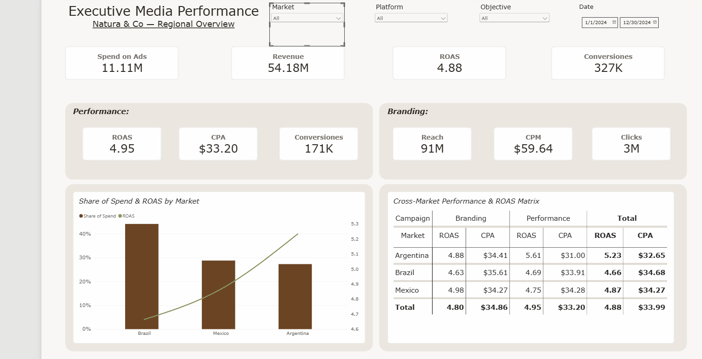
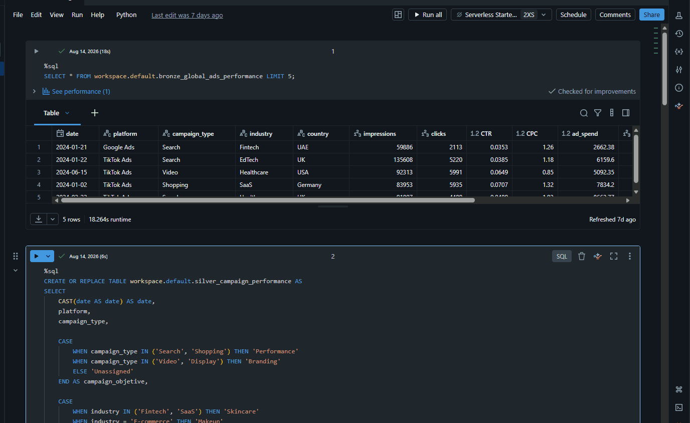
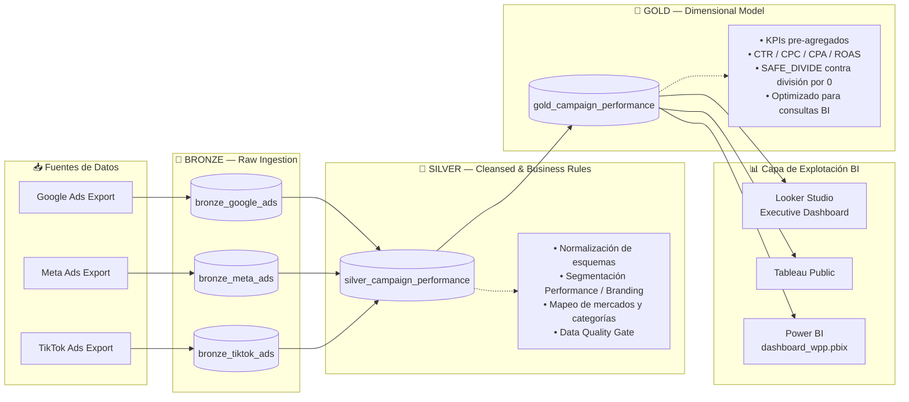

# 🌿 WPP Media Performance — Latam Analytics Pipeline

**End-to-end Data Pipeline & Dimensional Modeling for Digital Media Performance | Natura Latam Account**


---

## 📌 Tabla de Contenidos

- [1. Resumen Ejecutivo](#1-resumen-ejecutivo)
- [2. Arquitectura de Datos](#2-arquitectura-de-datos)
- [3. Detalle por Capa](#3-detalle-por-capa)
- [4. Data Quality & Testing](#4-data-quality--testing)
- [5. Stack Tecnológico](#5-stack-tecnológico)
- [6. Guía de Instalación y Ejecución](#6-guía-de-instalación-y-ejecución)
- [7. Estructura del Repositorio](#7-estructura-del-repositorio)
- [8. Conclusiones Técnicas y Valor de Negocio](#8-conclusiones-técnicas-y-valor-de-negocio)

---

# 📊 Executive BI Dashboard & Databricks




---

## 1. Resumen Ejecutivo

### El problema de negocio

**Natura Latam**, gestionada dentro del portfolio de **WPP Media**, invierte presupuesto de medios digitales de forma simultánea en **Google Ads, Meta Ads y TikTok Ads**, a través de **Brasil, México y Argentina**, sobre múltiples categorías de CPG/belleza (Skincare, Haircare, Makeup). Cada plataforma exporta reportes con esquemas, granularidades y nomenclaturas propias, lo que genera tres riesgos críticos para el equipo de medios:

1. **Inconsistencia de KPIs entre reportes** — cada Media Planner recalculando ROAS o CPA a su manera en Excel, con fórmulas distintas y resultados que no concilian entre mercados.
2. **Falta de trazabilidad** — sin una capa inmutable de datos crudos, una auditoría de medios (frecuente en cuentas de este tamaño) no puede reconstruirse.
3. **Fricción entre Data y BI** — dejar la lógica de negocio (tipo de campaña, agregaciones, manejo de división por cero) en las herramientas de visualización, donde es difícil de versionar, testear y auditar.

### La solución técnica

Un pipeline construido en **Databricks** bajo **Arquitectura Medallion (Bronze → Silver → Gold)** que centraliza el procesamiento en el motor de cloud computing en lugar de la capa de presentación, entregando una **única fuente de verdad (Single Source of Truth)**: la tabla `gold_campaign_performance`, modelada dimensionalmente y lista para conectarse directo a Looker Studio o Tableau sin transformaciones adicionales.

---

## 2. Arquitectura de Datos



**Principio de diseño:** la lógica de negocio y las fórmulas de KPIs viven en Databricks, **no** en la herramienta de BI. Esto garantiza que ROAS, CPA, CTR y CPC significan exactamente lo mismo sin importar si el usuario final abre Looker Studio, Tableau o el `.pbix` de Power BI — las tres capas de visualización leen la misma tabla Gold ya resuelta.

---

## 3. Detalle por Capa

### 🥉 Capa Bronze — Ingestión de Datos Crudos

**Objetivo:** preservar el dato exactamente como llega de cada plataforma, sin ninguna transformación, para garantizar trazabilidad y soportar auditorías de medios.

**Principios aplicados:**
- Inmutabilidad: las tablas Bronze nunca se actualizan in-place, solo se append-ean nuevas cargas.
- Esquema original preservado (nombres de columnas y tipos tal como los entrega cada API/exportación).
- Formato **Delta Lake** para versionado automático (`DESCRIBE HISTORY`) y rollback ante errores de carga.

```python
# Ingesta Bronze — ejemplo con TikTok Ads
from pyspark.sql.functions import current_timestamp, lit

df_tiktok_raw = (
    spark.read
    .option("header", True)
    .option("inferSchema", True)
    .csv("/mnt/raw/tiktok_ads/*.csv")
    .withColumn("_ingestion_timestamp", current_timestamp())
    .withColumn("_source_platform", lit("tiktok_ads"))
)

(df_tiktok_raw.write
    .format("delta")
    .mode("append")
    .saveAsTable("bronze.bronze_tiktok_ads")
)
```

---

### 🥈 Capa Silver — Limpieza, Estandarización y Reglas de Negocio

**Objetivo:** unificar los tres esquemas heterogéneos en un modelo común y aplicar la primera capa de lógica de Analytics Engineering.

**Transformaciones clave:**

**a) Segmentación estratégica de `campaign_objetive`**

Regla de negocio acordada con el equipo de planning: Search y Shopping son tácticas orientadas a conversión directa (**Performance**); Video y Display son tácticas de construcción de marca (**Branding**).

```python
from pyspark.sql.functions import col, when

df_silver = df_bronze_union.withColumn(
    "campaign_objetive",
    when(col("campaign_type").isin("Search", "Shopping"), "Performance")
    .when(col("campaign_type").isin("Video", "Display"), "Branding")
    .otherwise("Unclassified")
)
```

**b) Estandarización de mercados y categorías CPG**

```python
market_mapping = {
    "BR": "Brazil", "Brasil": "Brazil",
    "MX": "Mexico", "México": "Mexico",
    "AR": "Argentina", "Arg": "Argentina"
}

df_silver = df_silver.replace(market_mapping, subset=["market"])
```

**c) Normalización de tipos y limpieza de nulos estructurales**

```python
df_silver = (
    df_silver
    .withColumn("total_ad_spend", col("total_ad_spend").cast("double"))
    .withColumn("total_revenue", col("total_revenue").cast("double"))
    .dropDuplicates(["date", "platform", "campaign_type", "market", "product_category"])
    .filter(col("date").isNotNull())
)
```

---

### 🥇 Capa Gold — Modelo Dimensional y Agregación de KPIs

**Objetivo:** entregar una tabla pre-agregada, lista para consumo directo por herramientas de BI, con todos los KPIs de medios resueltos en el motor de cloud computing.

**Fórmulas de KPIs (Spark SQL) — con manejo seguro de división por cero:**

```sql
CREATE OR REPLACE TABLE gold.gold_campaign_performance AS
SELECT
    date,
    platform,
    campaign_type,
    campaign_objetive,
    product_category,
    market,
    SUM(impressions)          AS total_impressions,
    SUM(clicks)                AS total_clicks,
    SUM(ad_spend)               AS total_ad_spend,
    SUM(conversions)            AS total_conversions,
    SUM(revenue)                 AS total_revenue,

    -- CTR: Click-Through Rate
    CASE WHEN SUM(impressions) > 0
         THEN SUM(clicks) / SUM(impressions)
         ELSE 0 END AS ctr,

    -- CPC: Cost Per Click
    CASE WHEN SUM(clicks) > 0
         THEN SUM(ad_spend) / SUM(clicks)
         ELSE 0 END AS cpc,

    -- CPA: Cost Per Acquisition
    CASE WHEN SUM(conversions) > 0
         THEN SUM(ad_spend) / SUM(conversions)
         ELSE 0 END AS cpa,

    -- ROAS: Return on Ad Spend
    CASE WHEN SUM(ad_spend) > 0
         THEN SUM(revenue) / SUM(ad_spend)
         ELSE 0 END AS roas

FROM silver.silver_campaign_performance
GROUP BY date, platform, campaign_type, campaign_objetive, product_category, market
```

> **Nota de diseño:** estos KPIs se calculan a nivel de grano de campaña dentro de la tabla Gold. Cuando el consumo en BI requiere agregaciones adicionales (por mercado, por plataforma, por período), la capa de visualización **re-suma las métricas base** (`SUM(total_clicks)/SUM(total_impressions)`, etc.) en lugar de promediar las columnas `ctr`/`cpa`/`roas` ya calculadas — evitando así el clásico error de "promedio de promedios" que distorsiona el resultado ponderado por inversión real.

---


## 4. Stack Tecnológico

| Categoría | Herramienta |
|---|---|
| Procesamiento distribuido | Databricks Free Edition, Apache Spark (PySpark + Spark SQL) |
| Almacenamiento | Delta Lake (formato transaccional, versionado ACID) |
| Arquitectura de datos | Medallion Architecture (Bronze / Silver / Gold) |
| Calidad de datos | Validaciones SQL |
| Capa de BI | Power BI |
| Control de versiones | Git / GitHub |

---


## 5. Conclusiones Técnicas y Valor de Negocio

**Desde el punto de vista técnico**, este pipeline resuelve el problema de raíz en lugar de parchearlo en la capa de visualización: al centralizar el cálculo de KPIs en Databricks con `SAFE_DIVIDE`/`CASE WHEN` contra división por cero, y al aplicar reglas de negocio (segmentación Performance/Branding, mapeo de mercados) en una capa versionada y testeada, se elimina la posibilidad de que dos stakeholders reporten números distintos para el mismo período — el problema más costoso y más común en operaciones de medios multi-mercado.

**Desde el punto de vista de negocio**, el pipeline entrega:

- **Una única fuente de verdad** consumible simultáneamente desde Looker Studio, Tableau y Power BI, sin duplicar lógica de cálculo en cada herramienta.
- **Trazabilidad y auditabilidad**, crítica en cuentas de medios donde WPP debe poder justificar cada número frente al cliente (Natura) y frente a auditorías de agencia.
- **Un data quality gate explícito**, que convierte la validación de datos en un paso automatizado y evidenciable, no en una revisión manual ad-hoc antes de cada reporte.
- **Escalabilidad**: agregar un nuevo mercado o una nueva plataforma de medios requiere extender la capa Bronze y ajustar el mapeo en Silver — el modelo Gold y las fórmulas de KPIs no cambian.

---

<p align="center">
  <sub>Built with 🌿 for Natura Latam · WPP Media Analytics · 2026</sub>
</p>
